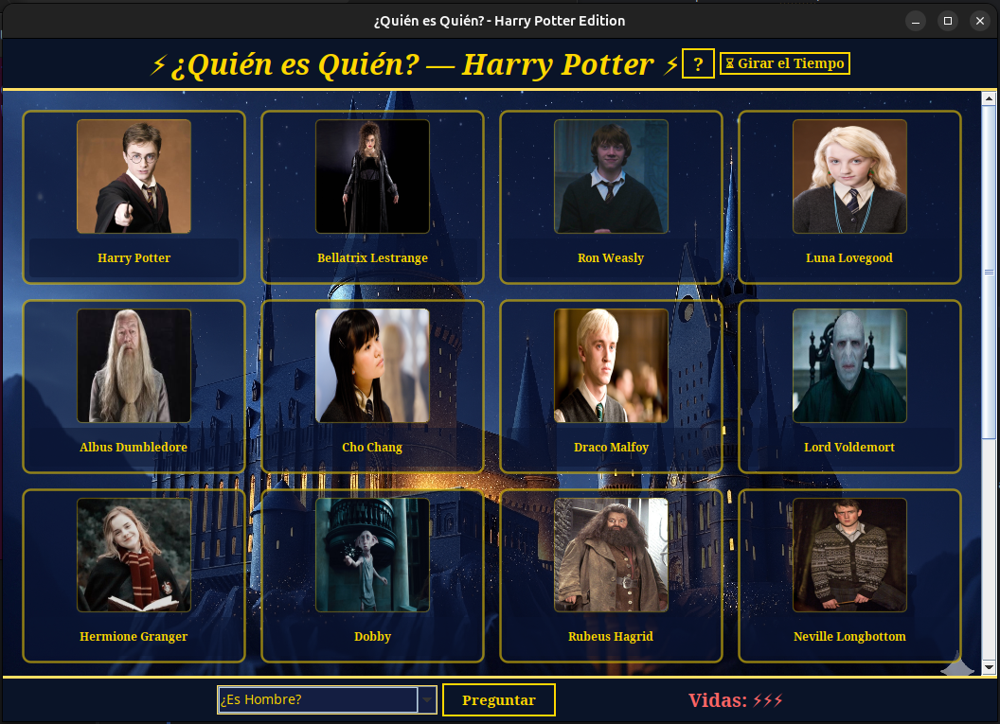
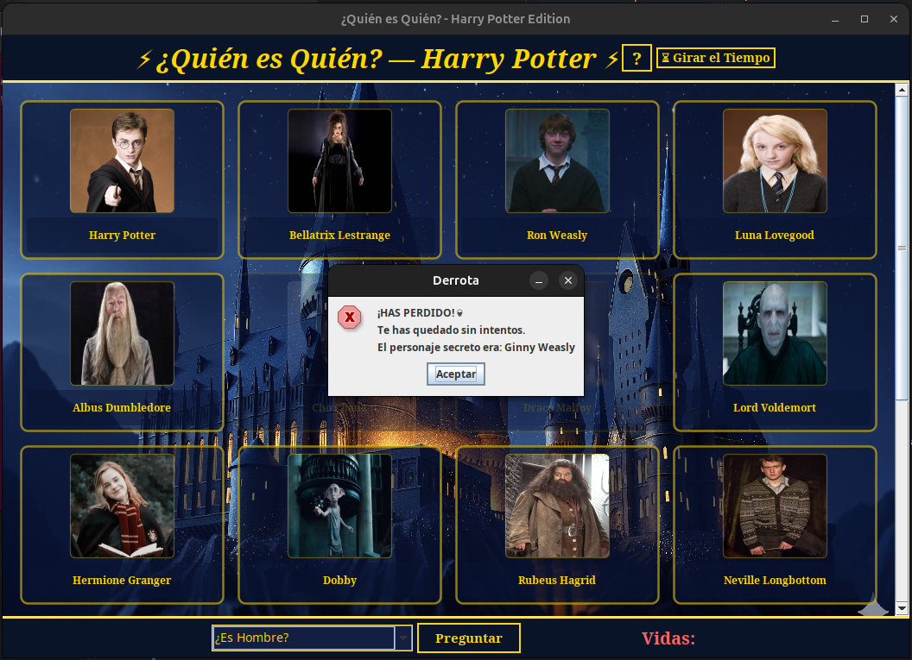

<div align="center">

  

# ⚡ ¿Quién es Quién? — Edición Mágica ⚡

**¡Pon a prueba tu astucia contra la Inteligencia Artificial más oscura!**

[](https://www.java.com/)
[](https://docs.oracle.com/javase/tutorial/uiswing/)
[](https://www.wizardingworld.com/)
  
---

  <p align="center">
    <a href="#-descripción-del-proyecto">Descripción</a> •
    <a href="#-capturas-del-tablero">Capturas</a> •
    <a href="#-reglas-del-juego">Reglas</a> •
    <a href="#-instalación-y-ejecución">Instalación</a> •
    <a href="#-autor">Autor</a>
  </p>
</div>

---

## 📜 Descripción del Proyecto

Bienvenido, joven mago/a. Has entrado en la biblioteca prohibida. Este proyecto es una recreación digital del clásico juego de mesa **"¿Quién es Quién?"**, desarrollado íntegramente en **Java**.

El objetivo es simple pero peligroso: debes descubrir qué personaje secreto ha seleccionado la máquina antes de que se agote tu magia. A través de preguntas deductivas ("hechizos de revelación"), irás descartando sospechosos hasta dar con la respuesta correcta.

> *"Son nuestras elecciones las que muestran lo que somos, mucho más que nuestras habilidades."* — Albus Dumbledore.

---

## 📸 Capturas del Tablero

<div align="center">
  
</div>

| 🔮 **Inicio de la Partida** | ⚡ **Sistema de Vidas** |
|:---:|:---:|
| *Todos los sospechosos están activos...* | *¡Cuidado! Cada fallo te acerca al final.* |
|  |  |

---

## ⚔️ Reglas del Juego

El duelo se rige por las antiguas leyes del Ministerio de Magia:

### 1. El Misterio 🕵️‍♂️
El sistema seleccionará aleatoriamente a uno de los **20 personajes** (Harry, Hermione, Voldemort, Dobby...). Nadie sabe quién es.

### 2. Los Hechizos (Filtrado) 🪄
Usa el panel de control (Bola de Cristal) para hacer preguntas sobre rasgos físicos:
* *¿Es hombre?*
* *¿Tiene el pelo rubio?*
* *¿Tiene gafas?*

Si la respuesta es **SÍ**, los que no cumplan la condición desaparecerán en la oscuridad. Si es **NO**, desaparecerán los que sí la cumplan.

### 3. El Juramento Inquebrantable (Vidas) 💀
Aquí es donde demuestras tu valentía. Tienes **3 VIDAS (Rayos ⚡)**.
* Si haces clic en una carta para adivinar y fallas: **Pierdes 1 vida**.
* Si tu contador llega a cero: **¡AVADA KEDAVRA!** Pierdes la partida y el secreto se revela.

---

## 🚀 Instalación y Ejecución

### Requisitos Previos 📋
Necesitas tener instalado el **JDK (Java Development Kit)** versión 8 o superior.

### Hechizo de Invocación (Terminal) 💻

1.  **Clonar el repositorio:**
    ```bash
    git clone [https://github.com/MelissaLinanGonzalez/Quien_Es_Quien.git](https://github.com/MelissaLinanGonzalez/Quien_Es_Quien.git)
    ```

2.  **Entrar en la carpeta del proyecto:**
    ```bash
    cd Quien_Es_Quien
    ```

3.  **Navegar a la mazmorra donde reside el ejecutable:**
    *(Esta es la ruta generada por el artefacto de IntelliJ)*
    ```bash
    cd QuienEsQuien/out/artifacts/QuienEsQuien_jar
    ```

4.  **Ejecutar el hechizo final:**
    ```bash
    java -jar QuienEsQuien.jar
    ```
---

## 🛠️ Tecnologías Usadas

Este proyecto ha sido forjado con:

* **Lenguaje:** Java ☕
* **Interfaz Gráfica:** Swing & AWT (Paneles personalizados, JButtons estilizados).
* **IDE:** IntelliJ IDEA.
* **Recursos:** Imágenes y assets inspirados en el Wizarding World.

---

## 🧙‍♂️ Autor

Desarrollado con magia y amor por:

**Melissa Liñán González** *Estudiante de Desarrollo de Aplicaciones Multiplataforma* *I.E.S. Antonio Gala*

---

<div align="center">
  <i>"Travesura realizada."</i> 👣
</div>